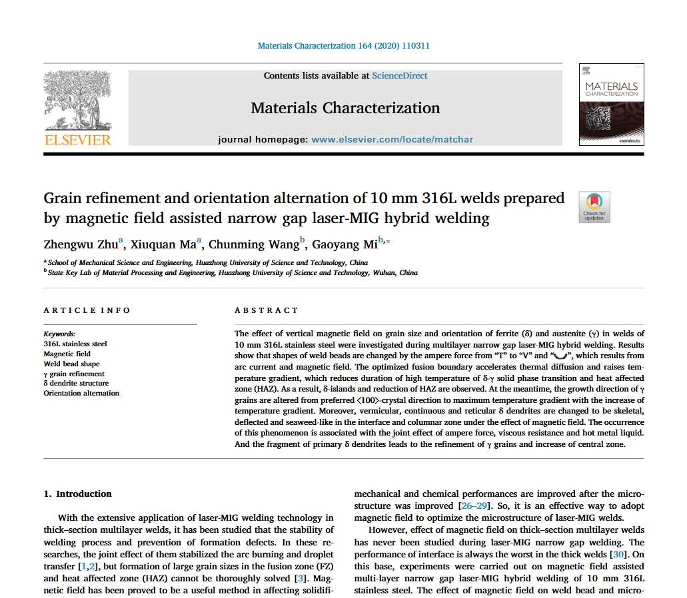
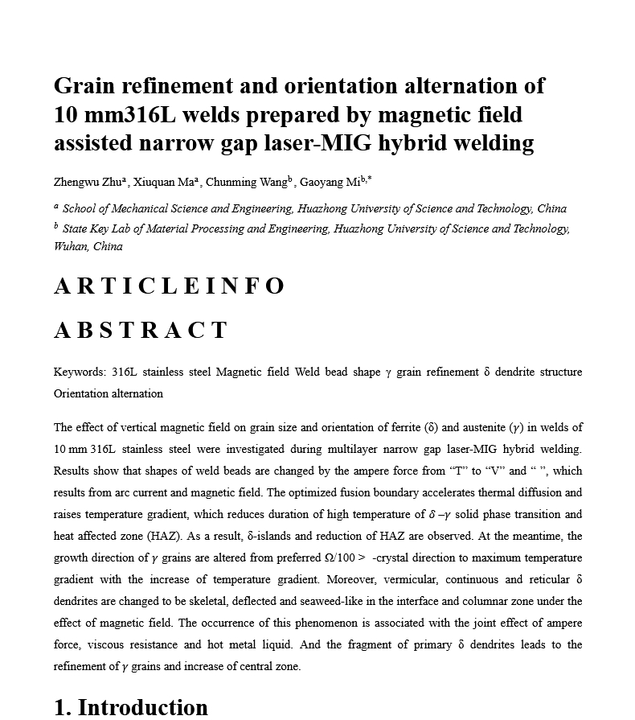

# MinerU HTML Parser for Zotero

Submit a Zotero PDF attachment to the MinerU precise parsing API, import the generated HTML back into Zotero, and open the HTML attachment automatically when parsing finishes.

[简体中文](README.zh-CN.md) | [English](README.en.md)

## Download

- [Latest XPI](https://github.com/understandlxy/mineru-html-parser-zotero/releases/latest/download/mineru-html-parser-0.1.96.xpi)
- [Latest Release](https://github.com/understandlxy/mineru-html-parser-zotero/releases/latest)
- [MinerU API Docs](https://mineru.net/apiManage/docs)

## PDF To HTML Comparison

This example shows the difference between the original paper PDF and the HTML attachment generated by the plugin. The HTML output keeps the paper content readable in Zotero while removing much of the dense PDF page chrome.

| Original PDF | Parsed HTML |
| --- | --- |
|  |  |

## Highlights

- Adds a Zotero context-menu action for parsing a selected PDF attachment into HTML.
- Imports the generated HTML and a postprocess report back to the same Zotero item.
- Opens the new HTML attachment in Zotero automatically after a successful parse.
- Builds the reading HTML from MinerU `full.md` first and asks MinerU to use the `doclayout_yolo` layout model so original figure regions are preserved before HTML generation.
- Keeps image blocks faithful to MinerU output instead of recombining split subfigures after parsing.
- Bundles KaTeX to render MinerU LaTeX fragments as MathML and uses a Times New Roman / Noto Serif SC reading font stack.
- Splits bracketed bibliography entries such as `[1] ... [2] ...` into separate reference paragraphs.
- Splits compact bare-numbered reference paragraphs such as `1. ... 2. ...` after a References heading.
- Keeps rendered math inside figure/table captions bold with the surrounding caption text.
- Uses an A4-like page width, screen margins, and print `@page` margins for paper-friendly HTML reading.
- Automatically compacts wide tables so multi-column tables fit inside the A4-style page.
- Cleans common reading friction in the generated HTML, including paragraph alignment, simple LaTeX, and figure OCR noise.

## Version 0.1.96

This release focuses on paper-like reading quality for MinerU output:

- Keeps Markdown output generation alive when a result archive does not contain HTML fallback files.
- Aligns the MinerU precise parsing request with the reference plugin's core payload.
- Embeds original MinerU zip images through byte-array base64 conversion instead of binary strings, avoiding silent JPEG byte corruption and dark image bands.
- Protects image data URLs during HTML postprocessing so text, formula, and unit cleanup rules cannot alter base64 characters.
- Uses original MinerU zip images directly instead of replacing them with local PDF crops, avoiding PDF.js/canvas color-space artifacts.
- Keeps postprocess reporting focused on HTML cleanup and image counts without PDF crop replacement counters.
- Splits bare-numbered References paragraphs into separate entries when MinerU compacts them into one paragraph.
- Repairs misplaced reference blocks where the first reference is parsed as a list item and the remaining numbered references are moved after an acknowledgments heading.
- Cleans title-page heading math, glued author markers, compact a/b affiliations, and misplaced numbered experimental-list items in Elsevier-style outputs.
- Restores title-page stainless-steel phrases such as `10 mm 316L` when MinerU emits the phrase as a KaTeX annotation.
- Keeps restored title-page math/text fragments bold so they match the surrounding paper title.
- Formats Elsevier/CIRP title pages where letter affiliation markers are glued to author surnames and affiliation rows are compacted without semicolons.
- Normalizes Springer/Elsevier title pages where author superscripts are rendered as KaTeX fragments or the corresponding-author asterisk is split from the author line.
- Formats MDPI-style title pages with a bold author line, superscript author markers, and numbered affiliation rows.
- Decodes escaped comparison operators in inline math before KaTeX rendering to avoid red error fragments.
- Formats title-page author, affiliation, and correspondence blocks with left-aligned, non-justified lines and numeric or letter superscript markers.
- Avoids treating ordinary connector words such as "and" as letter footnote markers.
- Removes the parsing model selector from preferences and keeps the current MinerU default parsing path.
- Preserves original grouped figures by using MinerU's `doclayout_yolo` layout path and avoiding post-hoc image recomposition.
- Renders inline and block LaTeX with bundled KaTeX MathML output.
- Uses Times New Roman / Noto Serif SC typography with an A4-style reading page and print margins.
- Splits compacted reference lists into one paragraph per bracketed reference.
- Keeps caption math bold and automatically compacts wide tables to fit the page.

## Acknowledgements

This plugin's MinerU request shape, Markdown-first rendering direction, formula rendering approach, and reference-list handling were informed by the Full Text Translate Zotero plugin.

Formula rendering is powered by a bundled KaTeX build.

